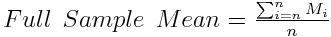
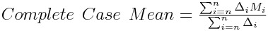
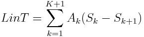
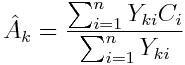
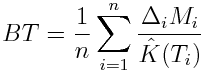

<!-- README.md is generated from README.Rmd. Please edit that file -->

```{r, echo = FALSE}
knitr::opts_chunk$set(
  collapse = TRUE,
  comment = "#>",
  fig.path = "man/figures/README-"
)
```

# ccostr
**(warning estimates might be wrong)**

R package to calculate estimates of total costs with censored data


## Overview
The ccmean function returns 5 estimates, these are:

 - Naive "Available Sample"
 - Naive "Complete Case"
 - Lin's method: *Lin et al. (1997)*
 - Bang and Tsiatis's method: *Bang and Tsiatis (2000)*
 - Zhao and Tian's method: *Zhao and Tian (2001)*


## Installation
```{r, eval = FALSE}
devtools::install_github("HaemAalborg/ccostr")

# Or including a vignette that demonstrates the bias and coverage of the estimators, this require library(parallel)
devtools::install_github("HaemAalborg/ccostr", build_vignettes = TRUE)
```


## Data format
Cost data should look something like this
```{r echo=FALSE}
id           <- c("A", "B" ,"C")

tcost        <- c(2544,4245,590)
delta        <- c(0,0,1)
surv         <- c(343,903,445)

df_0 <- data.frame(id, tcost, delta, surv)
print(df_0, row.names=FALSE)

```


It is possible to get better estimates of the true mean if cost history is available. This cost data can be both discreet or contenious
if so the data should look something like this:
```{r echo=FALSE}
id      <- c("A", "A", "A", "B" ,"C", "C")

start   <- c(1,30,88,18,1,67)
stop    <- c(1,82,88,198,5,88)
cost    <- c(550,1949,45,4245,23,567)
delta   <- c(0,0,0,0,1,1)
surv    <- c(343,343,343,903,445,445)

df_1 <- data.frame(id, start,stop,cost,delta,surv)
print(df_1, row.names=FALSE)
```


## Explanation of estimates
The package calculates two conventional but wrong estimates of the mean cost. The first is the full sample which divides total costs of all observations with the number of observations. This is correct if there is no censoring present. If there is it is underestimating the real costs due to missing information.



The scecond is the complete cases, here all data but the complete is filtered out. This creates a bias towards short observations as they have a greater chance of not being removed.




It is possible to come up with better estimates of the mean costs, there are two fundamental different approaches. The first takes into account only total costs over the whole period, but it is possible to improve this type of estimates if cost history is present. If that is the case this additional information is used in 

### Estimates without cost history





LinT
BT





### Estimates with cost history

LinA
LinB
ZT
BTp


## Usage

```{r}
library(ccostr)
library(survival)
library(dplyr)

ccmean(df_1, L = max(df_1$surv))
```

## Data simulation function

```{r}
# Simulate data with the simCostData function
sim <- simCostData(n = 100, dist = "unif", censor = "light", L = 100)

# Apply ccmean and limit to 10 years (the true mean is 40.000 see documentation)
result <- ccmean(sim[[2]], L = 10)
result[[3]]
```


## References

1. Lin, D. Y., E. J. Feuer, R. Etzioni, and Y. Wax. "Estimating Medical Costs from Incomplete Follow-Up Data." Biometrics 53, no. 2 (1997): 419-34.

2. H Bang, AA Tsiatis; Estimating medical costs with censored data, Biometrika, Volume 87, Issue 2, 1 June 2000, Pages 329-343.

3. Zhao, Hongwei, and Lili Tian. "On Estimating Medical Cost and Incremental Cost-Effectiveness Ratios with Censored Data." Biometrics 57, no. 4 (2001): 1002-008.


```{r eval=FALSE, include=FALSE}
# BT = \frac{1}{n}\sum_{i=1}^n\frac{\Delta_iM_i}{\hat{K}(T_i)}
# LinT = \sum_{k=1}^{K+1}A_k(S_k-S_{k+1})
# \hat{A}_k=\frac{\sum_{i=1}^nY_{ki}C_i}{\sum_{i=1}^nY_{ki}}

```


