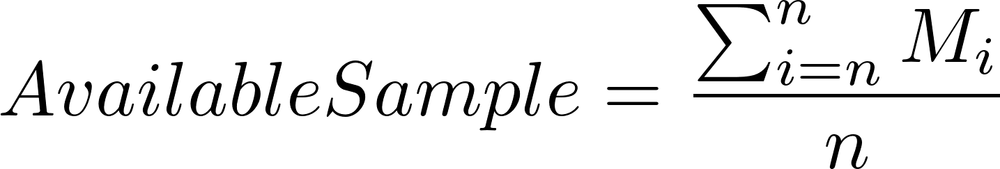
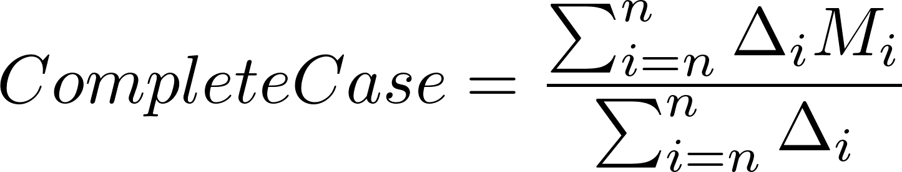
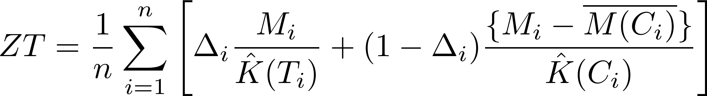

<!-- README.md is generated from README.Rmd. Please edit that file -->

```{r, echo = FALSE}
knitr::opts_chunk$set(
  collapse = TRUE,
  comment = "#>",
  fig.path = "man/figures/README-"
)
library(knitr)
```

# ccostr
ccostr is an R package to calculate estimates of mean total cost in censored cost data, ie. in situations where data is not fully observed within the study period.

## Installation
ccostr may be installed using the following command
```{r, eval = FALSE}
devtools::install_github("HaemAalborg/ccostr")

# Or including a vignette that demonstrates the bias and coverage
devtools::install_github("HaemAalborg/ccostr", build = TRUE, build_opts = c("--no-resave-data", "--no-manual"))
```

# Overview
The main function of ccostr is ccmean(), which implements 4 estimators, these are:

 - "Available Sample"
 - "Complete Case"
 - Bang and Tsiatis's method: *Bang and Tsiatis (2000)*
 - Zhao and Tian's method: *Zhao and Tian (2001)*


## Explanation of estimates
The package calculates two naïve but biased estimates of the mean cost. The first is the full sample which divides total costs of all observations with the number of observations. This is correct if there is no censoring present. With censored data it underestimates the true mean costs due to missing information.



The second is the complete case estimator, where only the fully observed cases are used. This creates a bias towards observations with shorter survival as they have a greater chance of not being censored, and this would normally also give a downward bias.



The BT estimator *Bang and Tsiatis (2000)*, weights the cost for the complete case with the probability of censoring at the event time.


If cost history is present, the above estimate may be improved by using the ZT estimator *Zhao and Tian (2001)*.



For all formulas above $n$ is number of individuals, $M_i$ and $\Delta_i$ are the total cost and event indicator for individual $i$, with $\Delta_i = 1$ or $\Delta_i = 0$ for respectively fully observed and censored cases. $\hat{K}(T_i)$ is the Kaplan-Meier estimator of the probability of censoring at time $T_i$, i.e. the time of event for individual $i$.   $\overline{M(C_i)}$ is the average of cost until time $C_i$ among individuals with event time later than $C_i$, and $\hat{K}(C_i)$ is the Kaplan-Meier estimator of the censoring probability at the time $T_i$.

## Data format
The accepted data format for ccmean is a dataframe as shown below with observations in rows. Columns detail the id for the observation, start and stop time for a time interval, the cost for the interval, the overall survival for the individual and a censoring indicator (1 = fully observed, 0 = censored). The dataset may contain multiple rows for the same individual detailing a cost history. If cost history is available, including it may lead to better estimates.
```{r echo=FALSE}
df_1 <- data.frame(id    = c("A", "A", "A", "B" ,"C", "C"),
                   start = c(1, 30, 88, 18, 1, 67),
                   stop  = c(1, 82, 88, 198, 5, 88),
                   cost  = c(550, 1949, 45, 4245, 23, 567),
                   delta = c(0, 0, 0, 0, 1, 1),
                   surv  = c(343, 343, 343, 903, 445, 445))
kable(df_1)
```

## Estimating the mean cost
The estimated average cost for the dataset shown above, is now calculated using ccmean.
```{r message=FALSE}
library(ccostr)

df_1_res <- ccmean(df_1)
df_1_res
```

## Simulation of data
ccostr also includes a function for simulating data in the correct format based on the method from Lin et al. (1997).
```{r}
# With the uniform distribution the true mean is 40.000, see documentation for further details.
sim <- simCostData(n = 1000, dist = "unif", censor = "heavy", L = 10)
sim_res <- ccmean(sim$censoredCostHistory)
sim_res
```


## References

1. Lin, D. Y., E. J. Feuer, R. Etzioni, and Y. Wax. "Estimating Medical Costs from Incomplete Follow-Up Data." Biometrics 53, no. 2 (1997): 419-34.

2. H Bang, AA Tsiatis; Estimating medical costs with censored data, Biometrika, Volume 87, Issue 2, 1 June 2000, Pages 329-343.

3. Zhao, Hongwei, and Lili Tian. "On Estimating Medical Cost and Incremental Cost-Effectiveness Ratios with Censored Data." Biometrics 57, no. 4 (2001): 1002-008.


```{r eval=FALSE, include=FALSE}
# BT = \frac{1}{n}\sum_{i=1}^n\frac{\Delta_iM_i}{\hat{K}(T_i)}
# LinT = \sum_{k=1}^{K+1}A_k(S_k-S_{k+1})
# \hat{A}_k=\frac{\sum_{i=1}^nY_{ki}C_i}{\sum_{i=1}^nY_{ki}}

```
