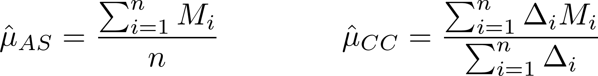
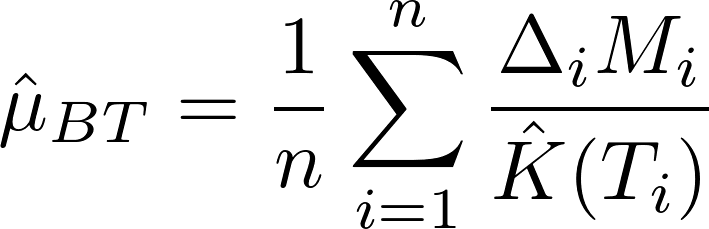
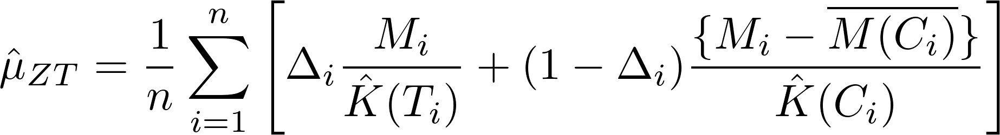

<!-- README.md is generated from README.Rmd. Please edit that file -->

```{r, echo = FALSE}
knitr::opts_chunk$set(
  collapse = TRUE,
  comment = "#>",
  fig.path = "man/figures/README-"
)
library(knitr)
```

# ccostr
[](http://joss.theoj.org/papers/0b9e631729dd9fadff3d6875e84ed954)
[](https://travis-ci.org/LarsHernandez/ccostr)
[](https://codecov.io/gh/LarsHernandez/ccostr)

ccostr is an R package to calculate estimates of mean total cost in censored cost data. Censoring is a frequent obstacle when working with time to event data, as e.g. not all patients in a medical study can be observed until death. For estimating the distribution of time to event the Kaplan-Meier estimator is useful, but when estimating mean costs it is not, since costs, opposed to time, do typically not accumulate at a constant rate. Often costs accumulate a at a higher rate at the beginning (e.g. at diagnosis) and end (e.g. death).

Several methods for estimating mean costs when working with censored data have been developed. Of note is the work by *(Lin et al, 1997)*, who proposed three different estimators. Later *(Bang and Tsiatis, 2000)* proposed another method based on inverse probability weighting, where complete (fully observed) cases are weighted with the probability of being censored at their event time. *(Zhao and Tian, 2001)* proposed an extension of the $BT$ estimator, $ZT$, which includes cost history from both censored and fully observed cases.

The primary function of ccostr is the implementation of the BT and ZT estimator

## Installation
ccostr may be installed using the following command
```{r, eval = FALSE}
devtools::install_github("HaemAalborg/ccostr")
# Or including a vignette that demonstrates the bias and coverage of the estimators
devtools::install_github("HaemAalborg/ccostr", build = TRUE, build_opts = c("--no-resave-data", "--no-manual"))
```

# Overview
The main function of ccostr is ccmean(), which implements 4 estimators, these are:

 - "Available Sample" estimator
 - "Complete Case" estimator
 - Bang and Tsiatis's estimator: *(Bang and Tsiatis, 2000)*
 - Zhao and Tian's estimator: *(Zhao and Tian, 2001)*


## Explanation of the estimators
The package calculates two naive estimates of the mean cost. The first is the available sample (AS) estimator which divides total costs of all observations with the number of observations. This is correct if there is no censoring present. With censored data it is underestimating the real costs due to missing information. The second is the complete cases  (CC) estimator, here all incomplete cases is filtered out. This creates a bias towards short cases as they have a greater chance of not being removed, and this would normally also give a downward bias.

<p align="center">
  
</p>

The BT estimator *(Bang and Tsiatis, 2000)*, weights the cost for the complete case with the probability of censoring at the event time.

<p align="center">

</p>

If cost history is present, the above estimator may be improved by using the ZT estimator *(Zhao and Tian, 2001)*.

<p align="center">

</p>

For all formulas above $n$ is number of individuals, $M_i$ and $\Delta_i$ are the total cost and event indicator for individual $i$, with $\Delta_i = 1$ or $\Delta_i = 0$ for respectively fully observed and censored cases. $\hat{K}(T_i)$ is the Kaplan-Meier estimator of the probability of censoring at time $T_i$, i.e. the time of event for individual $i$.   $\overline{M(C_i)}$ is the average of cost until time $C_i$ among individuals with event time later than $C_i$, and $\hat{K}(C_i)$ is the Kaplan-Meier estimator of the censoring probability at the time $T_i$.

## Data format
The accepted data format for ccmean is a dataframe as shown below with observations in rows. Columns detail the id for the observation, start and stop time for a time interval, the cost for the interval, the overall survival for the individual and a censoring indicator (1 = fully observed, 0 = censored). The dataset may contain multiple rows for the same individual detailing a cost history. If cost history is available, including it may lead to better estimates.
```{r echo=TRUE}
df <- data.frame(id    = c("A", "A", "A", "B" ,"C", "C", "D"),
                 start = c(1, 30, 88, 18, 1, 67, 43),
                 stop  = c(1, 82, 88, 198, 5, 88, 44),
                 cost  = c(550, 1949, 45, 4245, 23, 567, 300),
                 delta = c(0, 0, 0, 0, 1, 1, 1),
                 surv  = c(343, 343, 343, 903, 445, 445, 652))
kable(df)
```

## Estimating the mean cost
The estimated average cost for the dataset shown above, is now calculated using ccmean.
```{r message=FALSE}
library(ccostr)
ccmean(df, L = 1000)
```

## Simulation of data
ccostr also includes a function for simulating data in the correct format based on the method from *(Lin et al, 1997)*.
```{r}
# With the uniform distribution the true mean is 40.000, see documentation for further details.
sim <- simCostData(n = 1000, dist = "unif", censor = "heavy", L = 10)
ccmean(sim$censoredCostHistory)
```


## References

1. Lin, D. Y., E. J. Feuer, R. Etzioni, and Y. Wax. (1997) “Estimating Medical Costs from Incomplete Follow-Up Data”, Biometrics 53:2, 419-34.

2. Bang, H., A.A. Tsiatis (2000) "Estimating medical costs with censored data", Biometrika 87:2, 329-43.

3. Zhao, H., and T. Lili. (2001) “On Estimating Medical Cost and Incremental Cost-Effectiveness Ratios with Censored Data”, Biometrics 57:4, 1002-8.