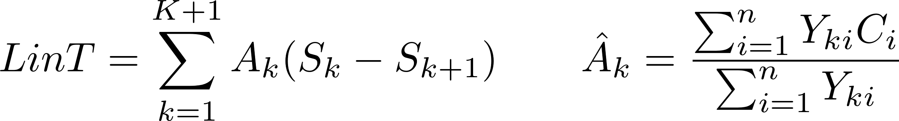
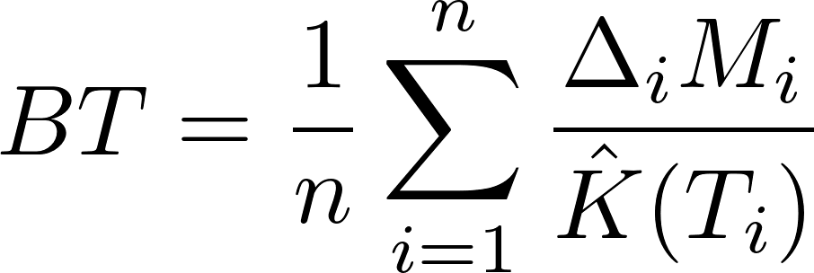

<!-- README.md is generated from README.Rmd. Please edit that file -->
ccostr
======

**(warning estimates might be wrong)**

R package to calculate estimates of total costs with censored data

Overview
--------

The ccmean function returns 5 estimates, these are:

-   Naive "Available Sample"
-   Naive "Complete Case"
-   Lin's method: *Lin et al. (1997)*
-   Bang and Tsiatis's method: *Bang and Tsiatis (2000)*
-   Zhao and Tian's method: *Zhao and Tian (2001)*

Installation
------------

``` r
devtools::install_github("HaemAalborg/ccostr")

# Or including a vignette that demonstrates the bias and coverage of the estimators, this require library(parallel)
devtools::install_github("HaemAalborg/ccostr", build_vignettes = TRUE)
```

Data format
-----------

Cost data should look something like this

    #>  id tcost delta surv
    #>   A  2544     0  343
    #>   B  4245     0  903
    #>   C   590     1  445

It is possible to get better estimates of the true mean if cost history is available. This cost data can be both discreet or contenious if so the data should look something like this:

    #>  id start stop cost delta surv
    #>   A     1    1  550     0  343
    #>   A    30   82 1949     0  343
    #>   A    88   88   45     0  343
    #>   B    18  198 4245     0  903
    #>   C     1    5   23     1  445
    #>   C    67   88  567     1  445

Explanation of estimates
------------------------

The package calculates two conventional but wrong estimates of the mean cost. The first is the full sample which divides total costs of all observations with the number of observations. This is correct if there is no censoring present. If there is it is underestimating the real costs due to missing information.


The scecond is the complete cases, here all data but the complete is filtered out. This creates a bias towards short observations as they have a greater chance of not being removed.


It is possible to come up with better estimates of the mean costs, there are two fundamental different approaches. The first takes into account only total costs over the whole period, but it is possible to improve this type of estimates if cost history is present. If that is the case this additional information is used in

### Estimates without cost history

 

LinT BT



### Estimates with cost history

LinA LinB ZT BTp

Usage
-----

``` r
library(ccostr)
#> Loading required package: dplyr
#> 
#> Attaching package: 'dplyr'
#> The following objects are masked from 'package:stats':
#> 
#>     filter, lag
#> The following objects are masked from 'package:base':
#> 
#>     intersect, setdiff, setequal, union
#> Loading required package: msm
#> Loading required package: survival
library(survival)
library(dplyr)

ccmean(df_1, L = max(df_1$surv))
#> [[1]]
#> [1] "These results should be checked before ..."
#> 
#> [[2]]
#>   available_sample complete_case LinT  BT       ZT
#> 1         2459.667           590  295 295 337.1667
#> 
#> [[3]]
#>          available_sample_full complete_case_full LinT_full    BT_full
#> Estimate              2459.667                590       295   295.0000
#> Variance                    NA                 NA        NA 36260.4167
#> SD                          NA                 NA        NA   190.4217
#> 95UCI                       NA                 NA        NA   668.2265
#> 95LCI                       NA                 NA        NA   -78.2265
#>              ZT_full
#> Estimate    337.1667
#> Variance 128185.6944
#> SD          358.0303
#> 95UCI      1038.9061
#> 95LCI      -364.5727
```

Data simulation function
------------------------

``` r
# Simulate data with the simCostData function
sim <- simCostData(n = 100, dist = "unif", censor = "light", L = 100)

# Apply ccmean and limit to 10 years (the true mean is 40.000 see documentation)
result <- ccmean(sim[[2]], L = 10)
result[[3]]
#>          available_sample_full complete_case_full LinT_full     BT_full
#> Estimate              33615.04           39927.51  41145.42   41145.419
#> Variance                    NA                 NA        NA 1104763.013
#> SD                          NA                 NA        NA    1051.077
#> 95UCI                       NA                 NA        NA   43205.530
#> 95LCI                       NA                 NA        NA   39085.308
#>              ZT_full
#> Estimate  41210.2784
#> Variance 992449.3250
#> SD          996.2175
#> 95UCI     43162.8648
#> 95LCI     39257.6921
```

References
----------

1.  Lin, D. Y., E. J. Feuer, R. Etzioni, and Y. Wax. "Estimating Medical Costs from Incomplete Follow-Up Data." Biometrics 53, no. 2 (1997): 419-34.

2.  H Bang, AA Tsiatis; Estimating medical costs with censored data, Biometrika, Volume 87, Issue 2, 1 June 2000, Pages 329-343.

3.  Zhao, Hongwei, and Lili Tian. "On Estimating Medical Cost and Incremental Cost-Effectiveness Ratios with Censored Data." Biometrics 57, no. 4 (2001): 1002-008.
