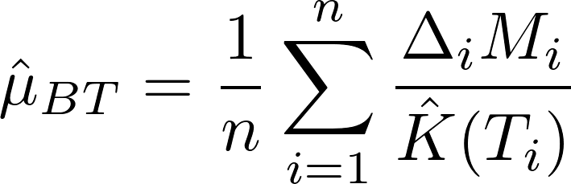

<!-- README.md is generated from README.Rmd. Please edit that file -->

# ccostr

ccostr is an R package to calculate estimates of mean total cost with
censored cost data, i.e. in situations where data are not fully observed
within the study period.

## Installation

ccostr may be installed using the following command

``` r
devtools::install_github("HaemAalborg/ccostr")
# Or including a vignette that demonstrates the bias and coverage of the estimators
devtools::install_github("HaemAalborg/ccostr", build = TRUE, build_opts = c("--no-resave-data", "--no-manual"))
```

# Overview

The main function of ccostr is ccmean(), which implements 4 estimators,
these are:

  - “Available Sample” estimator
  - “Complete Case” estimator
  - Bang and Tsiatis’s estimator: *(Bang and Tsiatis, 2000)*
  - Zhao and Tian’s estimator: *(Zhao and Tian, 2001)*

## Explanation of the estimators

The package calculates two conventional but wrong estimates of the mean
cost. The first is the available sample (AS) estimaor which divides total costs
of all observations with the number of observations. This is correct if
there is no censoring present. With censored data it is underestimating
the real costs due to missing information. The second is the complete
cases (CC) estimator, here all incomplete cases is filtered out. This creates a
bias towards short cases as they have a greater chance of not being
removed, and this would normally also give a downward bias.

<p align="center">


</p>

The BT estimator *(Bang and Tsiatis, 2000)*, weights the cost for the
complete case with the probability of censoring at the event time.

<p align="center">



</p>

If cost history is present, the above estimator may be improved by using
the ZT estimator *(Zhao and Tian, 2001)*.

<p align="center">


</p>

For all formulas above \(n\) is number of individuals, \(M_i\) and
\(\Delta_i\) are the total cost and event indicator for individual
\(i\), with \(\Delta_i = 1\) or \(\Delta_i = 0\) for respectively fully
observed and censored cases. \(\hat{K}(T_i)\) is the Kaplan-Meier
estimator of the probability of censoring at time \(T_i\), i.e. the time
of event for individual \(i\). \(\overline{M(C_i)}\) is the average of
cost until time \(C_i\) among individuals with event time later than
\(C_i\), and \(\hat{K}(C_i)\) is the Kaplan-Meier estimator of the
censoring probability at the time \(T_i\).

## Data format

The accepted data format for ccmean is a dataframe as shown below with
observations in rows. Columns detail the id for the observation, start
and stop time for a time interval, the cost for the interval, the
overall survival for the individual and a censoring indicator (1 = fully
observed, 0 = censored). The dataset may contain multiple rows for the
same individual detailing a cost history. If cost history is available,
including it may lead to better estimates.

| id | start | stop | cost | delta | surv |
| :- | ----: | ---: | ---: | ----: | ---: |
| A  |     1 |    1 |  550 |     0 |  343 |
| A  |    30 |   82 | 1949 |     0 |  343 |
| A  |    88 |   88 |   45 |     0 |  343 |
| B  |    18 |  198 | 4245 |     0 |  903 |
| C  |     1 |    5 |   23 |     1 |  445 |
| C  |    67 |   88 |  567 |     1 |  445 |
| D  |    43 |   44 |  300 |     1 |  652 |

## Estimating the mean cost

The estimated average cost for the dataset shown above, is now
calculated using ccmean.

``` r
library(ccostr)
df_1_res <- ccmean(df_1)
df_1_res
#> ccostr - Estimates of mean cost with censored data
#> 
#>   Observations Induviduals Events Limits TotalTime MaxSurv
#> N            7           4      2    903      2343     903
#> 
#>    Estimate  Variance     SD   95UCI   95LCI
#> AS  1919.75 849025.06 921.43 3725.74  113.76
#> CC   445.00  21025.00 145.00  729.20  160.80
#> BT   296.67  13618.21 116.70  525.39   67.94
#> ZT   504.75 283732.74 532.67 1548.77 -539.27
#> 
#> Mean survival time: 666.67 With SE: 108.12
```

## Simulation of data

ccostr also includes a function for simulating data in the correct
format based on the method from Lin et al. (1997).

``` r
# With the uniform distribution the true mean is 40.000, see documentation for further details.
sim <- simCostData(n = 1000, dist = "unif", censor = "heavy", L = 10)
sim_res <- ccmean(sim$censoredCostHistory)
sim_res
#> ccostr - Estimates of mean cost with censored data
#> 
#>   Observations Induviduals Events   Limits TotalTime  MaxSurv
#> N         3976        1000    604 9.999405  3468.517 9.999405
#> 
#>    Estimate Variance     SD    95UCI    95LCI
#> AS 28868.51 191476.5 437.58 29726.17 28010.86
#> CC 38096.54 141196.3 375.76 38833.03 37360.05
#> BT 39905.67 151616.1 389.38 40668.85 39142.49
#> ZT 39749.81 152582.1 390.62 40515.42 38984.20
#> 
#> Mean survival time: 4.92 With SE: 0.11
```

## References

1.  Lin, D. Y., E. J. Feuer, R. Etzioni, and Y. Wax. (1997) “Estimating Medical
    Costs from Incomplete Follow-Up Data”, Biometrics 53:2, 419-34.

2.  Bang, H., A.A. Tsiatis (2000) "Estimating medical costs with censored data"",
    Biometrika 87:2, 329-43.

3.  Zhao, H., and T. Lili. (2001) “On Estimating Medical Cost and
    Incremental Cost-Effectiveness Ratios with Censored Data”,
    Biometrics 57:4, 1002-8.
