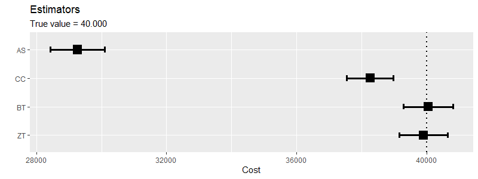

# Summary
Censoring is a frequent obstacle when working with time to event data, as e.g. not all patients in a medical study can be observed until death. For estimating the distribution of time to event the Kaplan-Meier estimator is useful, but when estimating mean costs it is not, since costs, opposed to time, do typically not accumulate at a constant rate. Often costs accumulate a at a higher rate at the beginning (e.g. at diagnosis) and end (e.g. death) of the study.

Several methods for estimating mean costs when working with censored data have been developed. Of note is the work by @Lin1997, who proposed three different estimators. The first, $LinT$, partitions the time period into small intervals and then estimates the mean costs by weighting the mean total cost of fully observed individuals in the interval with the probability of dying in the interval. The two others, $LinA$ and $LinB$, weight the mean total cost within each interval with the probability of being alive at respectively the start or end of the interval.

Later @Bang2000 proposed another method based on inverse probability weighting, where complete (fully observed) cases are weighted with the probability of being censored at their event time. Two estimators were presented: the simple weighted estimator, $BT$, using total costs for fully observed cases, and the partitioned estimator, $BTp$, utilizing cost history. @Zhao2001 proposed an extension of the $BT$ estimator, $ZT$, which includes cost history from both censored and fully observed cases. The $ZT$ estimator was later simplified by @Pfeifer2005.

In @Zhao2007 they demonstrated the similarity of the different estimators when using the distinct censoring times for defining intervals. They conclude that the following equalities hold for the estimates of mean cost: $\hat{\mu}_{BT} = \hat{\mu}_{LinT}$ and $\hat{\mu}_{LinA} = \hat{\mu}_{LinB} = \hat{\mu}_{BTp} = \hat{\mu}_{ZT}$. The estimators can be split into two classes: those that use and do not use cost history. As cost history contributes additional information these estimators are in general more efficient, and should be chosen if cost history is available.

Previous implementations of these estimators into statistical software have been done in Stata, first by @Kim2011 who implemented the method from @Lin1997, and later by @Chen2015 who implemented the $BT$ and $ZT$ estimators, and in {SAS} by @Zhao2010. To our knowledge none of the methods have previously been implemented in an R package.


# Estimators
The R package ccostr includes four different estimators of the mean cost. The average sample, $AS$, estimator simply averages the total cost per individual, disregarding censoring, giving a downwards biased estimate since costs after censoring are not accounted for. The complete case, $CC$, estimator averages the cost of only fully observed cases, biasing the estimate towards the average cost for individuals with shorter survival, typically downwards biased. These two naïve estimators are included as reference for the estimators accounting for censoring. For dealing with censored data we implement the $BT$ and $ZT$ estimators for handling situations with or without cost histories. 

Assume we observe $\left\{(T_i, \Delta_i, [M_i(u), 0 \leq u\leq T_i]), i=1,...,n\right\}$, where $n$ is the number of individuals, $T_i$ is the observation time, $M_i(u)$ the cost until time $u$, and $\Delta_i$ is event indicator for individual $i$, with $\Delta_i = 1$ or $\Delta_i = 0$ for fully observed and censored cases, respectively. Then the estimates are given by:

**Naive "Available Sample estimator" and "Complete Case estimator":**
$$\hat{\mu}_{AS} = \frac{\sum_{i=1}^nM_i}{n} \qquad \qquad \hat{\mu}_{CC} = \frac{\sum_{i=1}^n\Delta_iM_i}{\sum_{i=1}^n\Delta_i}.$$
where $M_i = M_i (T_i)$ denotes the total cost.

**Bang and Tsiatis's estimator (also known as Weighted Complete Case estimator):**
$$\hat{\mu}_{BT} = \frac{1}{n}\sum_{i=1}^n\frac{\Delta_iM_i}{\hat{K}(T_i)}$$
Where $\hat{K}(T_i)$ is the Kaplan-Meier estimator of the probability of censoring at time $T_i$, i.e. the time of event for individual $i$.

**Zhao and Tian's estimator (also known as Weighted Available Sample estimator):**
$$\hat{\mu}_{ZT} =\frac{1}{n}\sum_{i=1}^n\Bigg[\Delta_i\frac{M_i}{\hat{K}(T_i)} + (1-\Delta_i)\frac{\{M_i-\overline{M(C_i)}\}}{\hat{K}(C_i)}\Bigg],$$
where  $\overline{M(C_i)}$ is the average of cost until time $C_i$ among individuals with event time later than $C_i$, and $\hat{K}(C_i)$ is the Kaplan-Meier estimator of the censoring probability at the time $T_i$.

# Application
We have implemented the functions above in an R package, ccostr, and made it available at [https://github.com/HaemAalborg/ccostR](https://github.com/HaemAalborg/ccostR). The package includes two main functions, the first is ccmean() which calculates the mean cost until a time limit, specified with the parameter "L= ", and takes as input a dataframe in the following format:

```R
head(hcost)
```
```
##      id start  stop  cost   trt delta  surv
## 1     1     1     1  3694     0     0   575
## 2     1     1     9     1     0     0   575
## 3     1     1     9    12     0     0   575
## 4     1     1    34   106     0     0   575
## 5     1     1   237    68     0     0   575
## 6     1     1   237    86     0     0   575
```


The data shown above are simulated data from the Stata hcost package [@Chen2015]. Applying ccmean() on the data with a time limit of L = 1461, gives similar results as hcost. The option addInterpol adds a small value to the numerator and denominator of the fraction used for interpolation of cost at unobserved times, and is only used here to mimic the implementation in hcost, by default it is set to zero.

```R
c1 <- ccmean(hcost, L = 1461, addInterPol = 1)
c1
```
```
## ccostr - Estimates of mean cost with censored data
## 
##   Observations Induviduals Events Limits TotalTime MaxSurv
## N         9704         160     61   1461    122401    2082
## 
##    Estimate Variance      SD     95UCI    95LCI
## AS 63725.42 19193502 4381.04  72312.26 55138.59
## CC 74779.13 37572385 6129.63  86793.21 62765.05
## BT 86175.16 51593885 7182.89 100253.62 72096.70
## ZT 80134.84 23726332 4870.97  89681.94 70587.74
## 
## Mean survival time: 1165.04 With SE: 41.94
```


The second main function in ccostr is simCostData(). This function simulates data in the correct format according to the method in @Lin1997, and may be used for testing purposes:

```R
sim <- simCostData(n = 1000, dist = "unif", censor = "heavy", L = 10)
head(sim$censoredCostHistory)
```
```
##   id start     stop       cost     surv delta
## 1  1     0 1.000000 10189.0404 1.654524     0
## 2  1     1 1.654524   813.4767 1.654524     0
## 3  2     0 1.000000 11137.0038 6.158623     0
## 4  2     1 2.000000  1722.1321 6.158623     0
## 5  2     2 3.000000  1672.4579 6.158623     0
## 6  2     3 4.000000  1858.5673 6.158623     0
```


The true mean cost of the simulated dataset is 40,000 [@Lin1997]. Applying the ccmean function to the simulated data yields the result below. We here present the result graphically using the built in plotting function for an object with class ccobject.

```R
simMean <- ccmean(sim$censoredCostHistory)
plot(simMean) + 
  geom_hline(yintercept = 40000, linetype = "dotted", size = 1) +
  labs(subtitle = "True value = 40.000")
```




# References
